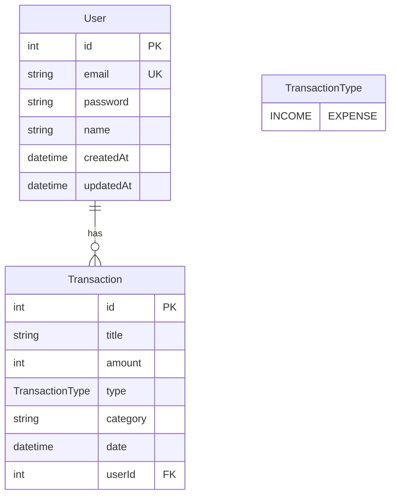
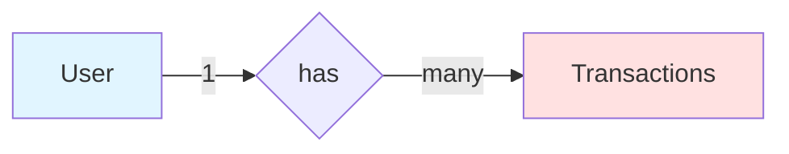

# 📊 Database Schema Documentation

## สารบัญ

- [ภาพรวม](#ภาพรวม)
- [Entity Relationship Diagram](#entity-relationship-diagram)
- [Tables](#tables)
- [Relationships](#relationships)
- [Indexes](#indexes)
- [Migrations](#migrations)

---

## ภาพรวม

ระบบใช้ **PostgreSQL** เป็น Database และจัดการผ่าน **Prisma ORM**

**Database Schema**: [schema.prisma](file:///Users/yongyut/Project/Personal/expense-tracker-api/prisma/schema.prisma)

### 📈 Statistics

- **Tables**: 2 (User, Transaction)
- **Enums**: 1 (TransactionType)
- **Relations**: 1 (User → Transactions: One-to-Many)

---

## Entity Relationship Diagram

### 🗺️ ER Diagram



### 🔗 Relationship Flow



---

## Tables

### 👤 User Table

**Purpose**: เก็บข้อมูลผู้ใช้งาน

#### Schema

```prisma
model User {
  id        Int      @id @default(autoincrement())
  email     String   @unique
  password  String
  name      String?
  createdAt DateTime @default(now())
  updatedAt DateTime @updatedAt
  
  transactions Transaction[]
}
```

#### Fields

| Field | Type | Constraints | Description |
|-------|------|-------------|-------------|
| **id** | `Int` | Primary Key, Auto-increment | รหัสผู้ใช้ |
| **email** | `String` | Unique, Not Null | อีเมลสำหรับ login |
| **password** | `String` | Not Null | รหัสผ่าน (hashed ด้วย bcrypt) |
| **name** | `String?` | Nullable | ชื่อผู้ใช้ |
| **createdAt** | `DateTime` | Not Null, Default: now() | วันที่สร้างบัญชี |
| **updatedAt** | `DateTime` | Not Null, Auto-update | วันที่อัพเดทล่าสุด |

#### Indexes

```sql
CREATE UNIQUE INDEX "User_email_key" ON "User"("email");
```

#### SQL Create Statement

```sql
CREATE TABLE "User" (
  "id" SERIAL PRIMARY KEY,
  "email" TEXT NOT NULL UNIQUE,
  "password" TEXT NOT NULL,
  "name" TEXT,
  "createdAt" TIMESTAMP(3) NOT NULL DEFAULT CURRENT_TIMESTAMP,
  "updatedAt" TIMESTAMP(3) NOT NULL
);
```

#### Sample Data

```json
{
  "id": 1,
  "email": "user@example.com",
  "password": "$2b$10$...",  // bcrypt hash
  "name": "John Doe",
  "createdAt": "2026-02-16T03:00:00.000Z",
  "updatedAt": "2026-02-16T03:00:00.000Z"
}
```

---

### 💰 Transaction Table

**Purpose**: เก็บรายการรายรับ-รายจ่าย

#### Schema

```prisma
model Transaction {
  id       Int             @id @default(autoincrement())
  title    String
  amount   Int      
  type     TransactionType
  category String   
  date     DateTime @default(now())
  userId   Int
  user     User     @relation(fields: [userId], references: [id])
}
```

#### Fields

| Field | Type | Constraints | Description |
|-------|------|-------------|-------------|
| **id** | `Int` | Primary Key, Auto-increment | รหัสธุรกรรม |
| **title** | `String` | Not Null | ชื่อรายการ (เช่น "ซื้อของ", "เงินเดือน") |
| **amount** | `Int` | Not Null | จำนวนเงิน (satang/cents) |
| **type** | `TransactionType` | Not Null, Enum | ประเภท: INCOME หรือ EXPENSE |
| **category** | `String` | Not Null | หมวดหมู่ (เช่น "อาหาร", "เงินเดือน") |
| **date** | `DateTime` | Not Null, Default: now() | วันที่ทำรายการ |
| **userId** | `Int` | Foreign Key | รหัสผู้ใช้ (อ้างอิงจาก User.id) |

#### SQL Create Statement

```sql
CREATE TABLE "Transaction" (
  "id" SERIAL PRIMARY KEY,
  "title" TEXT NOT NULL,
  "amount" INTEGER NOT NULL,
  "type" "TransactionType" NOT NULL,
  "category" TEXT NOT NULL,
  "date" TIMESTAMP(3) NOT NULL DEFAULT CURRENT_TIMESTAMP,
  "userId" INTEGER NOT NULL,
  CONSTRAINT "Transaction_userId_fkey" 
    FOREIGN KEY ("userId") REFERENCES "User"("id") 
    ON DELETE RESTRICT ON UPDATE CASCADE
);
```

#### Sample Data

```json
{
  "id": 1,
  "title": "เงินเดือน",
  "amount": 30000,
  "type": "INCOME",
  "category": "เงินเดือน",
  "date": "2026-02-01T00:00:00.000Z",
  "userId": 1
}
```

---

### 🏷️ TransactionType Enum

**Purpose**: กำหนดประเภทของธุรกรรม

#### Schema

```prisma
enum TransactionType {
  INCOME   // รายรับ
  EXPENSE  // รายจ่าย
}
```

#### SQL Definition

```sql
CREATE TYPE "TransactionType" AS ENUM ('INCOME', 'EXPENSE');
```

#### Usage

```typescript
// ใน DTO
@IsEnum(TransactionType)
type: TransactionType;

// การใช้งาน
const income: TransactionType = 'INCOME';
const expense: TransactionType = 'EXPENSE';
```

---

## Relationships

### 🔗 User → Transactions (One-to-Many)

**Relationship**: ผู้ใช้ 1 คน มีได้หลายรายการธุรกรรม

#### Prisma Definition

```prisma
model User {
  id           Int           @id @default(autoincrement())
  transactions Transaction[] // One-to-Many
}

model Transaction {
  id     Int  @id @default(autoincrement())
  userId Int
  user   User @relation(fields: [userId], references: [id])
}
```

#### Foreign Key Constraint

```sql
ALTER TABLE "Transaction" 
  ADD CONSTRAINT "Transaction_userId_fkey" 
  FOREIGN KEY ("userId") REFERENCES "User"("id") 
  ON DELETE RESTRICT 
  ON UPDATE CASCADE;
```

**Behavior**:
- **ON DELETE RESTRICT**: ไม่สามารถลบ User ที่มี Transactions อยู่
- **ON UPDATE CASCADE**: ถ้า User.id เปลี่ยน จะอัพเดท Transaction.userId ตาม

#### Query Examples

```typescript
// ดูผู้ใช้พร้อมธุรกรรมทั้งหมด
const userWithTransactions = await prisma.user.findUnique({
  where: { id: 1 },
  include: { transactions: true }
});

// ดูธุรกรรมพร้อมข้อมูลผู้ใช้
const transactionWithUser = await prisma.transaction.findUnique({
  where: { id: 1 },
  include: { user: true }
});

// นับจำนวนธุรกรรมของผู้ใช้
const user = await prisma.user.findUnique({
  where: { id: 1 },
  include: {
    _count: {
      select: { transactions: true }
    }
  }
});
```

---

## Indexes

### 📑 Existing Indexes

| Table | Column(s) | Type | Purpose |
|-------|-----------|------|---------|
| User | id | Primary Key | ค้นหาผู้ใช้ด้วย ID |
| User | email | Unique Index | ค้นหาและตรวจสอบ email ซ้ำ |
| Transaction | id | Primary Key | ค้นหาธุรกรรมด้วย ID |
| Transaction | userId | Foreign Key | Join กับ User table |

### 🚀 Performance Recommendations

เพื่อเพิ่มประสิทธิภาพ ควรเพิ่ม indexes ดังนี้:

```prisma
model Transaction {
  id       Int             @id @default(autoincrement())
  title    String
  amount   Int      
  type     TransactionType
  category String   
  date     DateTime @default(now())
  userId   Int
  user     User     @relation(fields: [userId], references: [id])

  @@index([userId, date])      // สำหรับ query ตามผู้ใช้และวันที่
  @@index([type])              // สำหรับ filter ตามประเภท
  @@index([category])          // สำหรับ group by category
}
```

#### การเพิ่ม Index

```bash
# 1. แก้ไข schema.prisma
# 2. สร้าง migration
npx prisma migrate dev --name add_transaction_indexes

# 3. Apply migration
npx prisma migrate deploy
```

---

## Migrations

### 📜 Migration History

**Location**: [prisma/migrations/](file:///Users/yongyut/Project/Personal/expense-tracker-api/prisma/migrations/)

#### Initial Migration

**File**: `20260212104303_migrat_db/migration.sql`

```sql
-- CreateEnum
CREATE TYPE "TransactionType" AS ENUM ('INCOME', 'EXPENSE');

-- CreateTable
CREATE TABLE "User" (
  "id" SERIAL NOT NULL,
  "email" TEXT NOT NULL,
  "password" TEXT NOT NULL,
  "name" TEXT,
  "createdAt" TIMESTAMP(3) NOT NULL DEFAULT CURRENT_TIMESTAMP,
  "updatedAt" TIMESTAMP(3) NOT NULL,
  
  CONSTRAINT "User_pkey" PRIMARY KEY ("id")
);

-- CreateTable
CREATE TABLE "Transaction" (
  "id" SERIAL NOT NULL,
  "title" TEXT NOT NULL,
  "amount" INTEGER NOT NULL,
  "type" "TransactionType" NOT NULL,
  "category" TEXT NOT NULL,
  "date" TIMESTAMP(3) NOT NULL DEFAULT CURRENT_TIMESTAMP,
  "userId" INTEGER NOT NULL,
  
  CONSTRAINT "Transaction_pkey" PRIMARY KEY ("id")
);

-- CreateIndex
CREATE UNIQUE INDEX "User_email_key" ON "User"("email");

-- AddForeignKey
ALTER TABLE "Transaction" 
  ADD CONSTRAINT "Transaction_userId_fkey" 
  FOREIGN KEY ("userId") REFERENCES "User"("id") 
  ON DELETE RESTRICT ON UPDATE CASCADE;
```

### 🔄 Migration Workflow

```bash
# 1. แก้ไข schema.prisma
# 2. สร้าง migration
npx prisma migrate dev --name <migration-name>

# ตัวอย่าง
npx prisma migrate dev --name add_phone_to_user

# 3. ตรวจสอบ migration file
cat prisma/migrations/<timestamp>_<migration-name>/migration.sql

# 4. Apply ใน production
npx prisma migrate deploy
```

### 🔙 Rollback Migration

```bash
# Reset database (development only)
npx prisma migrate reset

# Resolve specific migration
npx prisma migrate resolve --rolled-back <migration-name>
```

---

## Database Utilities

### 🛠️ Prisma Studio

เปิด GUI สำหรับจัดการข้อมูล:

```bash
npx prisma studio
```

เปิดที่: `http://localhost:5555`

### 📊 Database Queries

#### ตรวจสอบข้อมูล

```sql
-- นับจำนวน users
SELECT COUNT(*) FROM "User";

-- นับจำนวน transactions
SELECT COUNT(*) FROM "Transaction";

-- ดูรายรับ-รายจ่ายรวมของผู้ใช้
SELECT 
  u.name,
  SUM(CASE WHEN t.type = 'INCOME' THEN t.amount ELSE 0 END) as total_income,
  SUM(CASE WHEN t.type = 'EXPENSE' THEN t.amount ELSE 0 END) as total_expense
FROM "User" u
LEFT JOIN "Transaction" t ON u.id = t."userId"
GROUP BY u.id, u.name;
```

#### Performance Analysis

```sql
-- ดู query execution plan
EXPLAIN ANALYZE 
SELECT * FROM "Transaction" 
WHERE "userId" = 1 AND date BETWEEN '2026-02-01' AND '2026-02-28';

-- ดูขนาด table
SELECT 
  pg_size_pretty(pg_total_relation_size('"User"')) as user_size,
  pg_size_pretty(pg_total_relation_size('"Transaction"')) as transaction_size;
```

---

## Best Practices

### ✅ Database Design

1. **Use Transactions**: สำหรับ operations ที่เกี่ยวข้องกันหลายตัว
```typescript
await prisma.$transaction([
  prisma.user.create({ data: userData }),
  prisma.transaction.create({ data: transactionData }),
]);
```

2. **Use Indexes**: เพิ่ม index สำหรับ columns ที่ query บ่อย

3. **Validate Data**: ใช้ DTOs และ class-validator

4. **Backups**: สำรอง database สม่ำเสมอ
```bash
docker exec <container> pg_dump -U postgres expense_tracker > backup.sql
```

### 🔒 Security

1. **Never store plain passwords**: ใช้ bcrypt hash
2. **Use parameterized queries**: Prisma ป้องกัน SQL injection อัตโนมัติ
3. **Limit data exposure**: ใช้ `select` เลือกเฉพาะ fields ที่ต้องการ

```typescript
// ❌ ไม่ดี: ส่ง password ออกมา
const user = await prisma.user.findUnique({ where: { id: 1 } });

// ✅ ดี: ไม่เอา password
const user = await prisma.user.findUnique({
  where: { id: 1 },
  select: { id: true, email: true, name: true }
});
```

---

## สรุป

### 📝 Key Points

- **2 Main Tables**: User และ Transaction
- **1 Relationship**: User → Transactions (One-to-Many)
- **1 Enum**: TransactionType (INCOME/EXPENSE)
- **Managed by Prisma**: Type-safe ORM
- **PostgreSQL 15**: Production-ready database

### 📚 เอกสารที่เกี่ยวข้อง

- [Project Structure](PROJECT_STRUCTURE.md)
- [Commands Reference](COMMANDS.md)
- [API Guide](API_GUIDE.md)
- [Development Guide](DEVELOPMENT_GUIDE.md)
