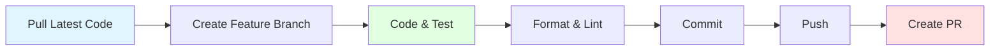

# 👨‍💻 Development Guide

## สารบัญ

- [Getting Started](#getting-started)
- [Development Workflow](#development-workflow)
- [Code Style Guide](#code-style-guide)
- [Module Creation](#module-creation)
- [Testing Strategy](#testing-strategy)
- [Debugging](#debugging)
- [Common Issues](#common-issues)

---

## Getting Started

### 🚀 สำหรับผู้เริ่มต้น

#### 1. Setup Environment

```bash
# ติดตั้ง Node.js (ใช้ nvm แนะนำ)
nvm install 24
nvm use 24

# ติดตั้ง Yarn
npm install -g yarn

# ติดตั้ง Docker Desktop
# Download from https://www.docker.com/products/docker-desktop/
```

#### 2. Clone และ Setup

```bash
# Clone repository
git clone <repository-url>
cd expense-tracker-api

# ติดตั้ง dependencies
yarn install

# Setup environment
cp .env.example .env
# แก้ไขไฟล์ .env

# รัน database
docker-compose up -d db

# Setup database
npx prisma migrate deploy
npx prisma generate

# รันโปรเจค
yarn start:dev
```

#### 3. ตรวจสอบว่า Setup สำเร็จ

```bash
# ตรวจสอบว่า API รันอยู่
curl http://localhost:3000/api

# ตรวจสอบ Swagger
open http://localhost:3000/api-docs

# ตรวจสอบ Prisma Studio
npx prisma studio
```

---

## Development Workflow

### 🔄 Day-to-Day Workflow



#### 1. **เริ่มงานใหม่**

```bash
# Pull code ล่าสุด
git checkout main
git pull origin main

# สร้าง feature branch
git checkout -b feature/add-categories

# รัน development server
yarn start:dev
```

#### 2. **พัฒนา**

```bash
# เขียนโค้ด
# แก้ไขไฟล์ใน src/

# ดูการเปลี่ยนแปลง (hot-reload)
# Server จะ restart อัตโนมัติ
```

#### 3. **ทดสอบ**

```bash
# รัน unit tests
yarn test

# รัน e2e tests
yarn test:e2e

# ดู coverage
yarn test:cov
```

#### 4. **Format และ Lint**

```bash
# Format code
yarn format

# Lint code
yarn lint

# หรือรวมกัน
yarn format && yarn lint
```

#### 5. **Commit**

```bash
# Add changes
git add .

# Commit (ใช้ Conventional Commits)
git commit -m "feat: add category management"

# Push
git push origin feature/add-categories
```

#### 6. **Create Pull Request**

- สร้าง PR บน GitHub/GitLab
- รอ Review
- Merge เมื่อได้รับอนุมัติ

---

## Code Style Guide

### 📝 NestJS Conventions

#### 1. **File Naming**

```
✅ ถูกต้อง:
create-user.dto.ts
user.entity.ts
auth.service.ts
jwt.strategy.ts

❌ ผิด:
createUser.dto.ts
UserEntity.ts
AuthService.ts
jwtStrategy.ts
```

#### 2. **Class Naming**

```typescript
// ✅ PascalCase สำหรับ classes
export class CreateUserDto {}
export class UserEntity {}
export class AuthService {}

// ❌ ไม่ใช้ camelCase
export class createUserDto {}
```

#### 3. **Variable/Function Naming**

```typescript
// ✅ camelCase
const userName = 'John';
function getUserById(id: number) {}

// ❌ ไม่ใช้ PascalCase หรือ snake_case
const UserName = 'John';
function get_user_by_id(id: number) {}
```

#### 4. **Constants**

```typescript
// ✅ UPPER_SNAKE_CASE
const MAX_RETRY_COUNT = 3;
const DEFAULT_PAGE_SIZE = 10;

// ❌ ไม่ใช้ camelCase
const maxRetryCount = 3;
```

### 🎨 Code Formatting

**Prettier Configuration** (`.prettierrc`):

```json
{
  "semi": true,
  "trailingComma": "all",
  "singleQuote": true,
  "printWidth": 80,
  "tabWidth": 2
}
```

**Examples**:

```typescript
// ✅ ถูกต้อง
export class AuthService {
  constructor(
    private usersService: UsersService,
    private jwtService: JwtService,
  ) {}

  async login(loginDto: LoginDto): Promise<AuthResponse> {
    const user = await this.usersService.findByEmail(loginDto.email);
    
    if (!user) {
      throw new UnauthorizedException('Invalid credentials');
    }
    
    return {
      access_token: await this.jwtService.signAsync(payload),
    };
  }
}
```

### 🔧 ESLint Rules

**Key Rules**:

```typescript
// ✅ ใช้ const/let แทน var
const name = 'John';
let age = 25;

// ❌ ไม่ใช้ var
var name = 'John';

// ✅ ใช้ === แทน ==
if (value === 10) {}

// ❌ ไม่ใช้ ==
if (value == 10) {}

// ✅ ไม่มี unused variables
const name = 'John';
console.log(name);

// ❌ มี unused variables
const name = 'John'; // ไม่ได้ใช้
```

---

## Module Creation

### 📦 สร้าง Module ใหม่

#### ใช้ NestJS CLI

```bash
# สร้าง module พร้อม service และ controller
nest generate resource categories

# หรือสร้างทีละส่วน
nest generate module categories
nest generate service categories
nest generate controller categories
```

#### โครงสร้างที่ได้

```
src/categories/
├── dto/
│   ├── create-category.dto.ts
│   └── update-category.dto.ts
├── entities/
│   └── category.entity.ts
├── categories.controller.ts
├── categories.service.ts
└── categories.module.ts
```

### 📝 Template สำหรับ Module ใหม่

#### DTO

```typescript
// create-category.dto.ts
import { IsString, IsNotEmpty } from 'class-validator';
import { ApiProperty } from '@nestjs/swagger';

export class CreateCategoryDto {
  @ApiProperty({ example: 'อาหาร' })
  @IsString()
  @IsNotEmpty()
  name: string;

  @ApiProperty({ example: 'หมวดหมู่ค่าใช้จ่ายด้านอาหาร' })
  @IsString()
  description?: string;
}
```

#### Service

```typescript
// categories.service.ts
import { Injectable } from '@nestjs/common';
import { PrismaService } from '../prisma/prisma.service';
import { CreateCategoryDto } from './dto/create-category.dto';

@Injectable()
export class CategoriesService {
  constructor(private prisma: PrismaService) {}

  async create(createCategoryDto: CreateCategoryDto) {
    return this.prisma.category.create({
      data: createCategoryDto,
    });
  }

  async findAll() {
    return this.prisma.category.findMany();
  }

  async findOne(id: number) {
    return this.prisma.category.findUnique({
      where: { id },
    });
  }
}
```

#### Controller

```typescript
// categories.controller.ts
import { Controller, Get, Post, Body, UseGuards } from '@nestjs/common';
import { ApiTags, ApiBearerAuth, ApiOperation } from '@nestjs/swagger';
import { CategoriesService } from './categories.service';
import { CreateCategoryDto } from './dto/create-category.dto';
import { JwtAuthGuard } from '../auth/guards/jwt-auth.guard';

@Controller('categories')
@ApiTags('Categories')
@ApiBearerAuth()
@UseGuards(JwtAuthGuard)
export class CategoriesController {
  constructor(private readonly service: CategoriesService) {}

  @Post()
  @ApiOperation({ summary: 'สร้างหมวดหมู่ใหม่' })
  create(@Body() createCategoryDto: CreateCategoryDto) {
    return this.service.create(createCategoryDto);
  }

  @Get()
  @ApiOperation({ summary: 'ดูรายการหมวดหมู่ทั้งหมด' })
  findAll() {
    return this.service.findAll();
  }
}
```

#### Module

```typescript
// categories.module.ts
import { Module } from '@nestjs/common';
import { CategoriesService } from './categories.service';
import { CategoriesController } from './categories.controller';
import { PrismaModule } from '../prisma/prisma.module';

@Module({
  imports: [PrismaModule],
  controllers: [CategoriesController],
  providers: [CategoriesService],
  exports: [CategoriesService],
})
export class CategoriesModule {}
```

---

## Testing Strategy

### 🧪 Unit Tests

#### Service Test Template

```typescript
// categories.service.spec.ts
import { Test, TestingModule } from '@nestjs/testing';
import { CategoriesService } from './categories.service';
import { PrismaService } from '../prisma/prisma.service';

describe('CategoriesService', () => {
  let service: CategoriesService;
  let prisma: PrismaService;

  beforeEach(async () => {
    const module: TestingModule = await Test.createTestingModule({
      providers: [
        CategoriesService,
        {
          provide: PrismaService,
          useValue: {
            category: {
              create: jest.fn(),
              findMany: jest.fn(),
              findUnique: jest.fn(),
            },
          },
        },
      ],
    }).compile();

    service = module.get<CategoriesService>(CategoriesService);
    prisma = module.get<PrismaService>(PrismaService);
  });

  it('should be defined', () => {
    expect(service).toBeDefined();
  });

  describe('create', () => {
    it('should create a category', async () => {
      const dto = { name: 'อาหาร', description: 'test' };
      const expected = { id: 1, ...dto };

      jest.spyOn(prisma.category, 'create').mockResolvedValue(expected as any);

      const result = await service.create(dto);
      expect(result).toEqual(expected);
      expect(prisma.category.create).toHaveBeenCalledWith({
        data: dto,
      });
    });
  });
});
```

### 🔬 E2E Tests

```typescript
// categories.e2e-spec.ts
import { Test, TestingModule } from '@nestjs/testing';
import { INestApplication } from '@nestjs/common';
import * as request from 'supertest';
import { AppModule } from './../src/app.module';

describe('CategoriesController (e2e)', () => {
  let app: INestApplication;
  let authToken: string;

  beforeAll(async () => {
    const moduleFixture: TestingModule = await Test.createTestingModule({
      imports: [AppModule],
    }).compile();

    app = moduleFixture.createNestApplication();
    await app.init();

    // Login to get token
    const loginResponse = await request(app.getHttpServer())
      .post('/api/auth/login')
      .send({ email: 'test@example.com', password: 'password' });
    
    authToken = loginResponse.body.data.access_token;
  });

  it('/api/categories (POST)', () => {
    return request(app.getHttpServer())
      .post('/api/categories')
      .set('Authorization', `Bearer ${authToken}`)
      .send({ name: 'อาหาร' })
      .expect(201);
  });

  afterAll(async () => {
    await app.close();
  });
});
```

---

## Debugging

### 🐛 Debug Configuration

#### VS Code Launch Configuration

```json
// .vscode/launch.json
{
  "version": "0.2.0",
  "configurations": [
    {
      "type": "node",
      "request": "launch",
      "name": "Debug NestJS",
      "runtimeExecutable": "yarn",
      "runtimeArgs": ["start:debug"],
      "console": "integratedTerminal",
      "restart": true,
      "protocol": "inspector",
      "skipFiles": ["<node_internals>/**"]
    }
  ]
}
```

#### Debugging Steps

1. Set breakpoints ในโค้ด
2. กด F5 หรือคลิก "Run and Debug"
3. ทดสอบ API ผ่าน Swagger หรือ curl
4. Debugger จะหยุดที่ breakpoint

### 📝 Logging

```typescript
// ใช้ NestJS Logger
import { Logger } from '@nestjs/common';

@Injectable()
export class AuthService {
  private readonly logger = new Logger(AuthService.name);

  async login(loginDto: LoginDto) {
    this.logger.log(`Login attempt for email: ${loginDto.email}`);
    
    try {
      // ... login logic
      this.logger.log(`Login successful for email: ${loginDto.email}`);
    } catch (error) {
      this.logger.error(`Login failed: ${error.message}`, error.stack);
      throw error;
    }
  }
}
```

### 🔍 Prisma Query Logging

```bash
# แสดง SQL queries
DEBUG="prisma:query" yarn start:dev

# แสดง debug logs ทั้งหมด
DEBUG="*" yarn start:dev
```

---

## Common Issues

### ❗ ปัญหาที่พบบ่อย

#### 1. Port Already in Use

```bash
# ปัญหา
Error: listen EADDRINUSE: address already in use :::3000

# วิธีแก้: หา process ที่ใช้ port และ kill
lsof -i :3000
kill -9 <PID>

# หรือเปลี่ยน port
PORT=3001 yarn start:dev
```

#### 2. Database Connection Error

```bash
# ปัญหา
Error: Can't reach database server at localhost:5432

# วิธีแก้: ตรวจสอบว่า database รันอยู่
docker-compose ps
docker-compose up -d db

# ตรวจสอบ DATABASE_URL ใน .env
echo $DATABASE_URL
```

#### 3. Prisma Client Not Generated

```bash
# ปัญหา
Error: @prisma/client did not initialize yet

# วิธีแก้: Generate Prisma Client
npx prisma generate

# หรือถ้ายังไม่ได้ ลอง
rm -rf node_modules/.prisma
yarn install
npx prisma generate
```

#### 4. Migration Issues

```bash
# ปัญหา
Error: Migration failed to apply

# วิธีแก้: Reset database (development only!)
npx prisma migrate reset

# หรือ resolve manually
npx prisma migrate resolve --applied <migration-name>
```

#### 5. JWT Token Invalid

```bash
# ปัญหา
Error: jwt malformed

# วิธีแก้: ตรวจสอบ JWT_SECRET ใน .env
# ตรวจสอบว่า token ถูกส่งถูกต้อง
curl -H "Authorization: Bearer <token>" http://localhost:3000/api/auth/me
```

---

## Git Workflow

### 🌿 Branch Strategy

```
main
├── develop
│   ├── feature/add-categories
│   ├── feature/add-budgets
│   └── bugfix/fix-auth-error
```

### 📝 Commit Message Convention

ใช้ **Conventional Commits**:

```bash
# Format
<type>(<scope>): <subject>

# Types
feat:     ฟีเจอร์ใหม่
fix:      แก้บัค
docs:     แก้เอกสาร
style:    แก้ formatting
refactor: ปรับโครงสร้างโค้ด
test:     เพิ่ม/แก้ tests
chore:    งานอื่นๆ (dependencies, config)

# Examples
feat(auth): add password reset feature
fix(transactions): fix date filter bug
docs(readme): update setup instructions
refactor(users): extract validation logic
test(auth): add login tests
chore(deps): update prisma to v7.2.1
```

---

## Environment Management

### 🔐 Environment Variables

```bash
# Development
.env

# Production
.env.production

# Staging
.env.staging

# Testing
.env.test
```

**Best Practices**:

```bash
# ✅ ใช้ environment-specific files
NODE_ENV=production yarn start:prod

# ✅ Never commit .env files
# เพิ่มใน .gitignore
.env
.env.local
.env.*.local

# ✅ ให้มี .env.example
cp .env.example .env
```

---

## Performance Tips

### ⚡ Optimization

#### 1. **Database Queries**

```typescript
// ❌ N+1 Query Problem
const users = await prisma.user.findMany();
for (const user of users) {
  const transactions = await prisma.transaction.findMany({
    where: { userId: user.id }
  });
}

// ✅ Use include
const users = await prisma.user.findMany({
  include: { transactions: true }
});
```

#### 2. **Caching**

```typescript
// ใช้ NestJS Cache Module
import { CacheModule } from '@nestjs/cache-manager';

@Module({
  imports: [CacheModule.register()],
})
export class AppModule {}
```

#### 3. **Pagination**

```typescript
// ✅ ใช้ pagination สำหรับข้อมูลจำนวนมาก
async findAll(page: number = 1, limit: number = 10) {
  const skip = (page - 1) * limit;
  
  return this.prisma.transaction.findMany({
    skip,
    take: limit,
    orderBy: { date: 'desc' },
  });
}
```

---

## สรุป

### 🎯 Key Points

1. **ใช้ NestJS CLI** สำหรับสร้าง modules/services/controllers
2. **ปฏิบัติตาม Naming Conventions** เพื่อความสม่ำเสมอ
3. **เขียน Tests** สำหรับ code ทุกส่วน
4. **ใช้ TypeScript** อย่างเต็มที่
5. **Format และ Lint** ก่อน commit ทุกครั้ง
6. **ใช้ Git ถูกต้อง** ด้วย Conventional Commits

### 📚 เอกสารที่เกี่ยวข้อง

- [Project Structure](PROJECT_STRUCTURE.md)
- [Commands Reference](COMMANDS.md)
- [Hexagonal Architecture](HEXAGONAL_ARCHITECTURE.md)
- [API Guide](API_GUIDE.md)
- [Database Schema](DATABASE_SCHEMA.md)
