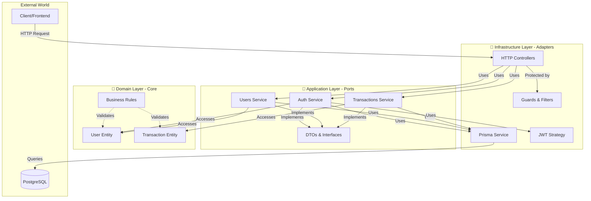
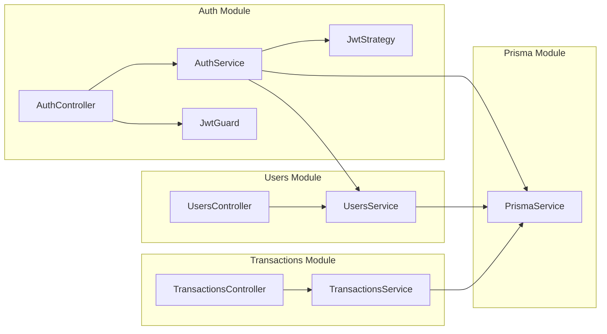

# 🏗️ Hexagonal Architecture (Ports and Adapters)

## สารบัญ

- [ภาพรวม](#ภาพรวม)
- [หลักการของ Hexagonal Architecture](#หลักการของ-hexagonal-architecture)
- [ประโยชน์](#ประโยชน์)
- [โครงสร้างแบบ Hexagonal](#โครงสร้างแบบ-hexagonal)
- [การนำไปใช้ในโปรเจคนี้](#การนำไปใช้ในโปรเจคนี้)
- [Architecture Diagram](#architecture-diagram)
- [แนวทางการพัฒนา](#แนวทางการพัฒนา)
- [ตัวอย่างการใช้งาน](#ตัวอย่างการใช้งาน)

---

## ภาพรวม

**Hexagonal Architecture** (หรือเรียกว่า **Ports and Adapters Pattern**) เป็นรูปแบบการออกแบบสถาปัตยกรรมซอฟต์แวร์ที่มุ่งเน้นการแยก **Business Logic** ออกจาก **External Dependencies** เพื่อให้โค้ดมีความยืดหยุ่น ทดสอบง่าย และบำรุงรักษาได้ดี

โปรเจค **Expense Tracker API** ได้นำหลักการของ Hexagonal Architecture มาประยุกต์ใช้ผ่าน **NestJS Framework** เพื่อสร้างระบบที่มีโครงสร้างชัดเจนและแยกความรับผิดชอบของแต่ละส่วนอย่างเหมาะสม

---

## หลักการของ Hexagonal Architecture

### 🎯 แนวคิดหลัก

1. **Business Logic เป็นศูนย์กลาง**: Logic หลักของแอปพลิเคชันไม่ควรขึ้นอยู่กับเทคโนโลยีภายนอก
2. **Dependency Inversion**: ชั้นนอกต้องขึ้นอยู่กับชั้นใน ไม่ใช่ในทางกลับกัน
3. **Ports and Adapters**: 
   - **Ports** = Interface สำหรับติดต่อกับ Business Logic
   - **Adapters** = Implementation ที่เชื่อมต่อกับระบบภายนอก

### 📊 โครงสร้าง 3 ชั้น

```
┌─────────────────────────────────────────┐
│     Infrastructure Layer (Adapters)     │
│  Controllers, Prisma, JWT, External APIs │
└──────────────┬──────────────────────────┘
               │
┌──────────────▼──────────────────────────┐
│      Application Layer (Ports)          │
│   Services, DTOs, Use Cases, Interfaces │
└──────────────┬──────────────────────────┘
               │
┌──────────────▼──────────────────────────┐
│         Domain Layer (Core)              │
│    Entities, Business Rules, Value Objects│
└─────────────────────────────────────────┘
```

---

## ประโยชน์

### ✅ ข้อดี

- **Testability** 🧪: ทดสอบ Business Logic ได้โดยไม่ต้องพึ่ง Database หรือ External Services
- **Flexibility** 🔄: เปลี่ยน Database, Framework, หรือ External Services ได้ง่าย
- **Maintainability** 🛠️: โค้ดมีโครงสร้างชัดเจน แก้ไขและเพิ่มฟีเจอร์ง่าย
- **Independence** 🎯: Business Logic ไม่ขึ้นอยู่กับ UI, Database, หรือ Framework
- **Reusability** ♻️: Logic หลักสามารถนำกลับมาใช้ได้ในหลายที่

### 📈 Use Cases ที่เหมาะสม

- โปรเจคขนาดกลางถึงใหญ่
- ระบบที่ต้องการ Test Coverage สูง
- แอปพลิเคชันที่อาจเปลี่ยน Database หรือ External Services
- ระบบที่มีการพัฒนาระยะยาว

---

## โครงสร้างแบบ Hexagonal

### 🔷 1. Domain Layer (Core)

**ความรับผิดชอบ**: ธุรกิจหลัก, กฎเกณฑ์ทางธุรกิจ

**ประกอบด้วย**:
- **Entities**: โมเดลข้อมูลหลักของระบบ
- **Value Objects**: ออบเจ็กต์ที่มีค่าแต่ไม่มี Identity
- **Domain Services**: Logic ทางธุรกิจที่ซับซ้อน
- **Business Rules**: กฎเกณฑ์และ Validation ทางธุรกิจ

**ตัวอย่างในโปรเจคนี้**:
```typescript
// Domain Entity (ยังไม่ได้แยกชัดเจน - ยังใช้ Prisma Schema)
// ใน Hexagonal แบบบริสุทธิ์ ควรมี Domain Entity แยกต่างหาก
```

> [!NOTE]
> ในโปรเจคนี้ใช้ Prisma Schema เป็น Entity ตรง ๆ ซึ่งเป็นการ Simplify
> ในโปรเจคใหญ่ ควรแยก Domain Entity และ Prisma Model ออกจากกัน

---

### 🔶 2. Application Layer (Use Cases / Ports)

**ความรับผิดชอบ**: กำหนด Use Cases และ Interface สำหรับติดต่อกับ Domain

**ประกอบด้วย**:
- **Services**: Business Logic และ Use Cases
- **DTOs (Data Transfer Objects)**: โครงสร้างข้อมูลสำหรับรับ-ส่ง
- **Interfaces**: Contract สำหรับ Infrastructure Layer
- **Ports**: Input/Output Interfaces

**ตัวอย่างในโปรเจคนี้**:

**Services** ([auth.service.ts](file:///Users/yongyut/Project/Personal/expense-tracker-api/src/auth/auth.service.ts)):
```typescript
@Injectable()
export class AuthService {
  constructor(
    private usersService: UsersService,
    private jwtService: JwtService,
  ) {}

  async login(loginDto: LoginDto): Promise<AuthResponse> {
    // Business Logic: ตรวจสอบ credentials
    const user = await this.usersService.findByEmail(loginDto.email);
    if (!user) {
      throw new UnauthorizedException('Invalid credentials');
    }
    
    const isPasswordValid = await bcrypt.compare(
      loginDto.password,
      user.password,
    );
    if (!isPasswordValid) {
      throw new UnauthorizedException('Invalid credentials');
    }

    // สร้าง JWT Token
    const payload: JwtPayload = { sub: user.id, email: user.email };
    return {
      access_token: await this.jwtService.signAsync(payload),
    };
  }
}
```

**DTOs** (Data Transfer Objects):
```typescript
// src/auth/dto/login.dto.ts
export class LoginDto {
  @IsEmail()
  email: string;

  @IsString()
  @MinLength(6)
  password: string;
}
```

**Interfaces** (Ports):
```typescript
// src/auth/interfaces/jwt-payload.interface.ts
export interface JwtPayload {
  sub: number;
  email: string;
}

// src/auth/interfaces/auth-response.interface.ts
export interface AuthResponse {
  access_token: string;
}
```

---

### 🔵 3. Infrastructure Layer (Adapters)

**ความรับผิดชอบ**: เชื่อมต่อกับโลกภายนอก (Database, HTTP, External APIs)

**ประกอบด้วย**:
- **Controllers**: รับ HTTP Requests และส่ง Responses
- **Database Adapters**: Prisma Service
- **External Services**: JWT, bcrypt, Email Services
- **Configuration**: Environment variables, Config modules

**ตัวอย่างในโปรเจคนี้**:

**Controllers** ([auth.controller.ts](file:///Users/yongyut/Project/Personal/expense-tracker-api/src/auth/auth.controller.ts)):
```typescript
@Controller('auth')
@ApiTags('Authentication')
export class AuthController {
  constructor(private readonly authService: AuthService) {}

  @Post('register')
  @ApiOperation({ summary: 'ลงทะเบียนผู้ใช้ใหม่' })
  async register(@Body() registerDto: RegisterDto) {
    return this.authService.register(registerDto);
  }

  @Post('login')
  @ApiOperation({ summary: 'เข้าสู่ระบบ' })
  async login(@Body() loginDto: LoginDto) {
    return this.authService.login(loginDto);
  }
}
```

**Database Adapter** (Prisma Service):
```typescript
// src/prisma/prisma.service.ts
@Injectable()
export class PrismaService extends PrismaClient implements OnModuleInit {
  async onModuleInit() {
    await this.$connect();
  }

  async onModuleDestroy() {
    await this.$disconnect();
  }
}
```

**Strategy (JWT)** ([jwt.strategy.ts](file:///Users/yongyut/Project/Personal/expense-tracker-api/src/auth/strategies/jwt.strategy.ts)):
```typescript
@Injectable()
export class JwtStrategy extends PassportStrategy(Strategy) {
  constructor() {
    super({
      jwtFromRequest: ExtractJwt.fromAuthHeaderAsBearerToken(),
      ignoreExpiration: false,
      secretOrKey: process.env.JWT_SECRET,
    });
  }

  async validate(payload: JwtPayload) {
    return { userId: payload.sub, email: payload.email };
  }
}
```

---

## การนำไปใช้ในโปรเจคนี้

### 📁 โครงสร้างโฟลเดอร์

```
src/
├── 🔵 Infrastructure Layer
│   ├── auth/
│   │   ├── auth.controller.ts          # HTTP Adapter (Input)
│   │   └── strategies/
│   │       └── jwt.strategy.ts         # JWT Adapter
│   ├── users/
│   │   └── users.controller.ts
│   ├── transactions/
│   │   └── transactions.controller.ts
│   └── prisma/
│       └── prisma.service.ts           # Database Adapter (Output)
│
├── 🔶 Application Layer
│   ├── auth/
│   │   ├── auth.service.ts             # Use Cases
│   │   ├── dto/                        # Data Transfer Objects
│   │   └── interfaces/                 # Ports
│   ├── users/
│   │   ├── users.service.ts
│   │   └── dto/
│   └── transactions/
│       ├── transactions.service.ts
│       └── dto/
│
└── 🔷 Domain Layer
    ├── auth/
    │   └── entities/                   # Domain Entities (Simplified)
    ├── users/
    │   └── entities/
    └── transactions/
        └── entities/
```

### 🔄 Data Flow

```
HTTP Request
    ↓
Controller (Infrastructure)
    ↓
Service (Application)
    ↓
Prisma (Infrastructure)
    ↓
Database
```

---

## Architecture Diagram

### 🏛️ แผนภาพสถาปัตยกรรมแบบ Hexagonal



### 📊 โครงสร้างโมดูล



---

## แนวทางการพัฒนา

### ✅ Best Practices

#### 1. **แยก Concerns ให้ชัดเจน**

```typescript
// ❌ ไม่ควร: Service ทำหลายอย่างเกินไป
export class UserService {
  async createUser(data) {
    // ❌ ไม่ควรมี HTTP logic ใน Service
    const response = await fetch('...');
    
    // ❌ ไม่ควรมี Validation logic แบบนี้
    if (!data.email.includes('@')) {
      throw new Error('Invalid email');
    }
    
    // ✅ Service ควรทำแค่ Business Logic
    return this.prisma.user.create({ data });
  }
}

// ✅ ควร: แยก Concerns
export class CreateUserDto {
  @IsEmail() // Validation อยู่ใน DTO
  email: string;
}

export class UserService {
  // Service มีแค่ Business Logic
  async createUser(createUserDto: CreateUserDto) {
    return this.prisma.user.create({ 
      data: createUserDto 
    });
  }
}
```

#### 2. **ใช้ Dependency Injection**

```typescript
// ✅ ดี: ใช้ DI
@Injectable()
export class TransactionsService {
  constructor(
    private prisma: PrismaService // Inject dependencies
  ) {}
  
  async create(data: CreateTransactionDto) {
    return this.prisma.transaction.create({ data });
  }
}

// ❌ ไม่ดี: สร้าง instance เอง
export class TransactionsService {
  private prisma = new PrismaService(); // Hard-coded dependency
}
```

#### 3. **ใช้ Interface สำหรับ Ports**

```typescript
// ✅ ดี: กำหนด Interface
export interface IAuthService {
  login(loginDto: LoginDto): Promise<AuthResponse>;
  register(registerDto: RegisterDto): Promise<UserWithoutPassword>;
}

@Injectable()
export class AuthService implements IAuthService {
  // Implementation
}
```

#### 4. **เก็บ Business Logic ไว้ใน Services**

```typescript
// ❌ ไม่ดี: Logic อยู่ใน Controller
@Controller('transactions')
export class TransactionsController {
  @Post()
  async create(@Body() dto: CreateTransactionDto) {
    // ❌ Business logic ไม่ควรอยู่ใน Controller
    if (dto.type === 'EXPENSE' && dto.amount < 0) {
      dto.amount = Math.abs(dto.amount);
    }
    return this.service.create(dto);
  }
}

// ✅ ดี: Logic อยู่ใน Service
@Injectable()
export class TransactionsService {
  async create(dto: CreateTransactionDto) {
    // ✅ Business logic อยู่ใน Service
    const amount = dto.type === 'EXPENSE' 
      ? Math.abs(dto.amount) 
      : dto.amount;
    
    return this.prisma.transaction.create({
      data: { ...dto, amount }
    });
  }
}
```

---

## ตัวอย่างการใช้งาน

### 📝 ตัวอย่าง: การสร้าง Transaction

#### 1. Client ส่ง Request (Infrastructure - Input)

```typescript
// HTTP Request
POST /api/transactions
{
  "title": "ซื้อของ",
  "amount": 500,
  "type": "EXPENSE",
  "category": "อาหาร"
}
```

#### 2. Controller รับ Request (Infrastructure)

```typescript
// src/transactions/transactions.controller.ts
@Controller('transactions')
export class TransactionsController {
  constructor(private service: TransactionsService) {}

  @Post()
  @UseGuards(JwtAuthGuard) // Infrastructure: Authentication
  async create(
    @Request() req,
    @Body() dto: CreateTransactionDto // DTO Validation
  ) {
    return this.service.create(req.user.userId, dto);
  }
}
```

#### 3. Service ประมวลผล Business Logic (Application)

```typescript
// src/transactions/transactions.service.ts
@Injectable()
export class TransactionsService {
  constructor(private prisma: PrismaService) {}

  async create(userId: number, dto: CreateTransactionDto) {
    // Application Logic
    return this.prisma.transaction.create({
      data: {
        title: dto.title,
        amount: dto.amount,
        type: dto.type,
        category: dto.category,
        date: dto.date ? new Date(dto.date) : undefined,
        user: {
          connect: { id: userId },
        },
      },
    });
  }
}
```

#### 4. Prisma บันทึกลง Database (Infrastructure - Output)

```typescript
// src/prisma/prisma.service.ts
@Injectable()
export class PrismaService extends PrismaClient {
  // Adapter สำหรับ Database
  async transaction.create(...) {
    // บันทึกลง PostgreSQL
  }
}
```

---

## สรุป

### 🎯 Key Takeaways

1. **Hexagonal Architecture** ช่วยแยก Business Logic จาก Technical Details
2. **3 Layers หลัก**: Domain (Core) → Application (Ports) → Infrastructure (Adapters)
3. **NestJS** รองรับ Hexagonal Architecture ด้วย Modules, Services, และ DI
4. **Benefits**: Testable, Maintainable, Flexible, Independent

### 📚 อ่านเพิ่มเติม

- [หลักการของ Hexagonal Architecture](https://alistair.cockburn.us/hexagonal-architecture/)
- [Clean Architecture by Uncle Bob](https://blog.cleancoder.com/uncle-bob/2012/08/13/the-clean-architecture.html)
- [NestJS Documentation](https://docs.nestjs.com/)

---

**เอกสารที่เกี่ยวข้อง**:
- [โครงสร้างโปรเจค](PROJECT_STRUCTURE.md)
- [Development Guide](DEVELOPMENT_GUIDE.md)
- [API Guide](API_GUIDE.md)
